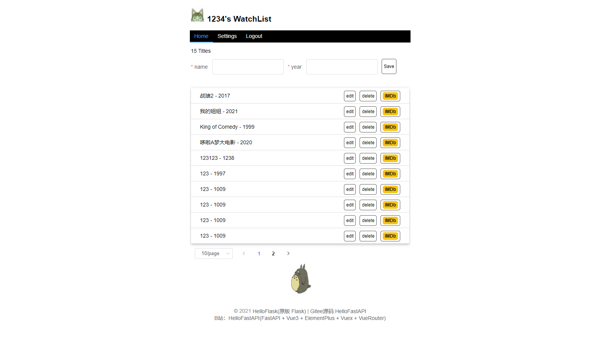
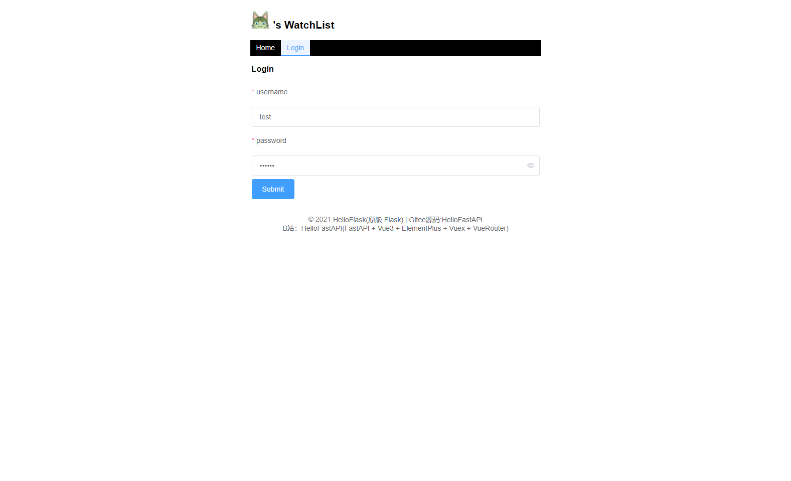
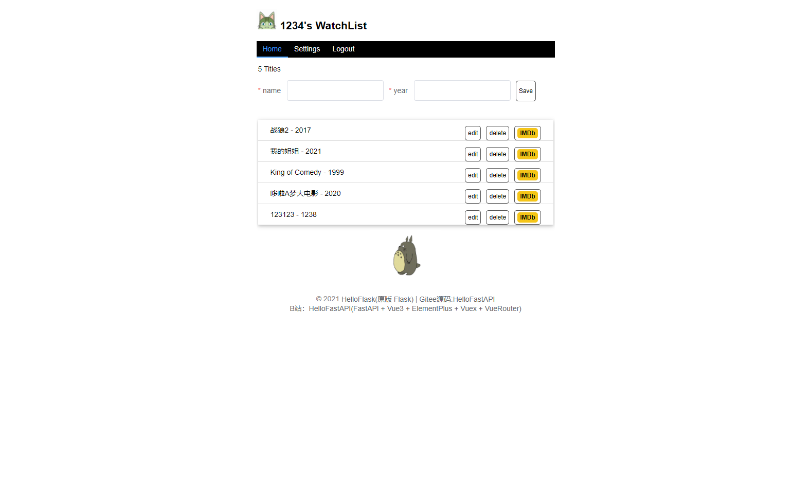
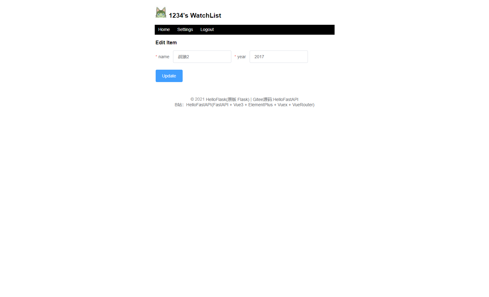
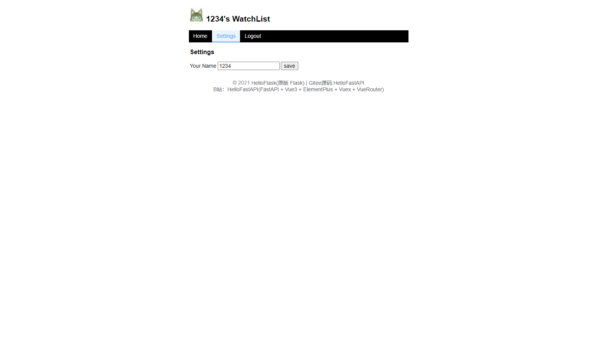

# 介绍
>仿 [HelloFlask](http://helloflask.com/book/3/) 一书中的项目
[点击查看对应视频](https://space.bilibili.com/438858333/channel/detail?cid=190225&ctype=0)  
> 前端使用(JavaScript)：Vue3(Setup 语法糖) + Vuex + VueRouter + Axios + ElementPlus + Vite2  
> 后端使用(Python): FastAPI + Tortoise ORM + SQLite  
> 如果对你有帮助还请给个Star/B站视频给个三连
# 目录简介
backend 为后端源码  
frontend 为前端源码
# 进度
## 后端
- [x] 接口完成 
## 前端
- [x] 页面交互功能完成
## 功能清单
- [x] 登录
- [x] 修改昵称
- [x] 添加电影
- [x] 删除电影
- [x] 编辑电影
- [x] 查看电影列表
## 效果预览

## Docker 部署
1.安装Docker-compose
2. `git clone https://gitee.com/zy7y/watch-fastapi`
3. `cd watch-fastapi`
4. 执行 `docker-compose up -d`
4. 访问`IP:1339` 后端 `IP:2153`前端
# 源码及资料
Gitee: https://gitee.com/zy7y/watch-fastapi  
Github: https://github.com/zy7y/watch-fastapi  
B站实录视频：https://space.bilibili.com/438858333/channel/detail?cid=190225&ctype=0

# 最后
>感谢各位来访，如果你觉得做的还可以还请给该项目一个Star/B站视频给个三连.
## 致谢
感谢以上所有用到的技术栈、框架的作者及其团队
- [x] [FastAPI](https://fastapi.tiangolo.com/zh/)
- [x] [Tortoise ORM](https://tortoise.github.io/)
- [x] [Vue3](https://v3.cn.vuejs.org/)
- [x] [Vuex](https://next.vuex.vuejs.org/zh/index.html)
- [x] [VueRouter](https://next.router.vuejs.org/zh/)
- [x] [Axios](https://axios-http.com/)
- [x] [ElementPlus](https://element-plus.gitee.io/zh-CN/)
- [x] [Vite2](https://cn.vitejs.dev/)

感谢CoderWhy老师的视频教程
- [x] [Vue2](https://www.bilibili.com/video/BV17j411f74d?spm_id_from=333.999.0.0)

感谢李辉老师的Hello Flask书籍及该项目的原版
- [x] [Hello Flask](http://helloflask.com/book/3/)
- [x] [watchlist](https://github.com/greyli/watchlist)

